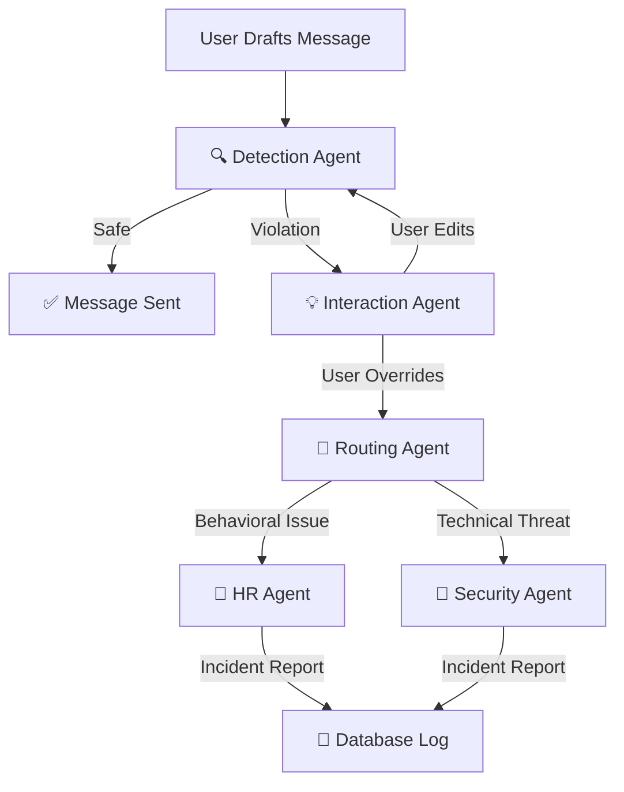

# Security Agent Workflow Demo 🛡️

**Developed for Yash Technologies Hackathon**

This project demonstrates a multi-agent system designed to secure corporate communications in real-time. Built with **FastAPI**, **Streamlit**, **LangGraph**, and **Groq (Llama 3)**, it showcases how AI agents can collaborate to detect, intervene, and resolve security policy violations.

---

## 🤖 Agent Workflow

The system is governed by a state graph that orchestrates the following flow:



### Agents Overview

1.  **🔍 Detection Agent**: Analyzes every draft message for three categories of violations:
    *   **Toxicity**: Hate speech, harassment, unprofessional language.
    *   **PII**: Leaked passwords, SSNs, API keys.
    *   **Adversarial**: Prompt injection attacks, jailbreak attempts.

2.  **💡 Interaction Agent (The Nudge)**:
    *   If a violation is found, this agent intervenes **before** the message is sent.
    *   It explains *why* the message was flagged and provides a polite, policy-compliant **Suggested Rewrite**.

3.  **🔀 Routing Agent**:
    *   If a user chooses to **Override** the warning and send anyway, this agent analyzes the context to route the incident.
    *   Non-technical issues (harassment) $\to$ **HR**.
    *   Technical issues (data leaks) $\to$ **Security**.

4.  **👥 HR & 🔐 Security Resolution Agents**:
    *   These agents act as autonomous workers that review the escalated incident.
    *   They generate a formal **Incident Report** including severity assessment (Low/Medium/Critical) and recommended actions (Warning/Suspension/Block).

---

## 🚀 Features

*   **Real-time Intervention**: feedback loop prevents violations before they happen.
*   **Role-Based Dashboards**:
    *   **Employee**: Chat interface with AI nudges.
    *   **HR Admin**: Review and resolve behavioral incidents.
    *   **Security Lead**: Manage data leak threads and adversarial attacks.
    *   **Global Admin**: System-wide statistics and audit logs.
*   **Human-in-the-loop**: Users can override agents (at their own risk), and Admins review agent decisions.

---

## 🛠️ Setup & Running

### 1. Prerequisites
*   Python 3.10+
*   Groq API Key (Set in `backend/.env` as `GROQ_API_KEY=your_key_here`)

### 2. Install Dependencies
```bash
pip install -r backend/requirements.txt
pip install streamlit pandas requests
```

### 3. Run the System

You need to run the Backend and Frontend in separate terminals.

**Terminal 1: Backend API**
```bash
uvicorn backend.app.main:app --reload --port 8000
```

**Terminal 2: Frontend Dashboard**
```bash
streamlit run streamlit_app/streamlit_app.py
```

### 4. Access the App
Open your browser to: **http://localhost:8501**

*   **Employee Login**: username `alice` / role `Employee`
*   **HR Login**: username `bob` / role `HR Admin`
*   **Security Login**: username `charlie` / role `Security Lead`
*   **Admin Login**: username `admin` / role `Global Admin`

## ⚠️ Disclaimer

**This project is a Proof of Concept (PoC) for demonstration purposes only.**

The authentication system implemented here is **not secure** and should **never** be used in a production environment. 
- It uses simple hardcoded logic or basic database lookups without password hashing or legitimate session management (JWT/OAuth).
- The focus of this demo is entirely on the **Agentic AI Workflows**, not on web security best practices.
