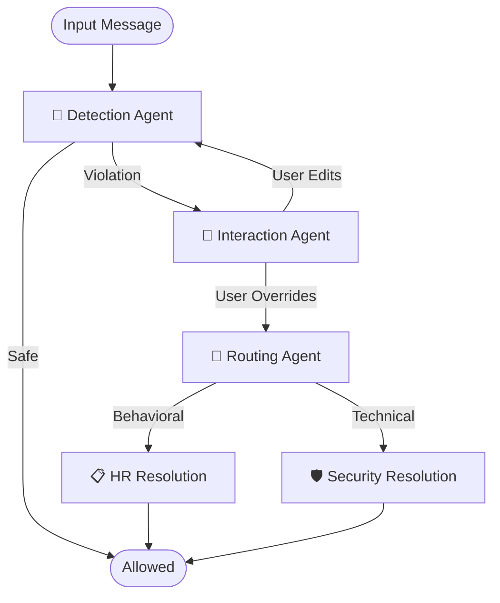

# Multi-Agent Security System Walkthrough

I have built a robust, autonomous multi-agent security system using **LangGraph** and **ChatGroq (Llama 3.1)**. The system filters, interacts, and routes communications based on content safety.

## 🚀 How to Run

1.  **Set your API Key** in `security_agents/.env` (if not already set):
    ```bash
    GROQ_API_KEY=your_actual_api_key
    ```
2.  **Run the Demo**:
    ```bash
    cd security_agents
    python demo.py
    ```

## 🧠 System Architecture

The system consists of 5 specialized agents working in a graph:



### Agents Breakdown

| Agent | Function | LLM Handling |
|-------|----------|--------------|
| **Detection** | Scans text for Toxicity, PII, Adversarial content. | Uses robust JSON parsing to handle Llama-3 output. |
| **Interaction** | Generates a polite "nudge" and suggests edits. | Drafts context-aware explanations. |
| **Routing** | Classifies incidents as **HR** or **Security**. | Analyzes risk level and provides routing rationale. |
| **HR Resolution** | Handles behavioral/ethics violations. | Generates formal `HR INCIDENT REPORT` with recommended actions. |
| **Security Resolution** | Handles data leaks/technical threats. | Generates `SECURITY INCIDENT REPORT` with threat assessment. |

## 📂 Project Structure

- `src/agents.py`: core logic for all 5 agents (LLM prompts & JSON parsing).
- `src/graph.py`: LangGraph definition wiring the agents together.
- `src/state.py`: Shared state definition (`AgentState`).
- `demo.py`: Runs 4 scenarios (Safe, Edited, HR Severity, Security Severity).
- `logs/`: Directory where detailed execution logs are saved as `.txt` files.

## ✅ Verification Results

I verified the system with 4 scenarios:
1.  **Safe Email**: Allowed immediately.
2.  **Toxicity (User Edits)**: Flagged -> Nudged -> User Edited -> Allowed.
3.  **Toxicity (Override)**: Flagged -> Overridden -> Routed to **HR** (Medium Severity).
4.  **Data Leak (Override)**: Flagged -> Overridden -> Routed to **Security** (High/Critical Severity).

All scenarios produced correct parsed JSON and detailed logs.
